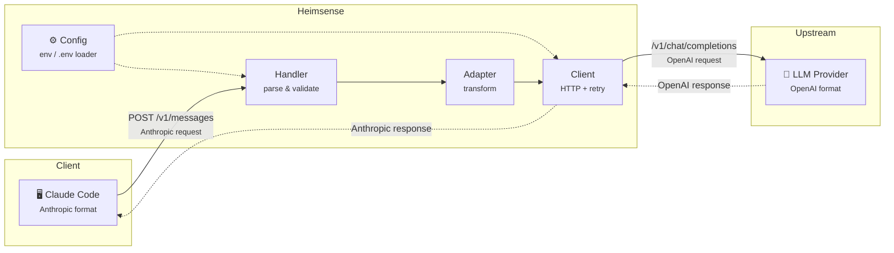
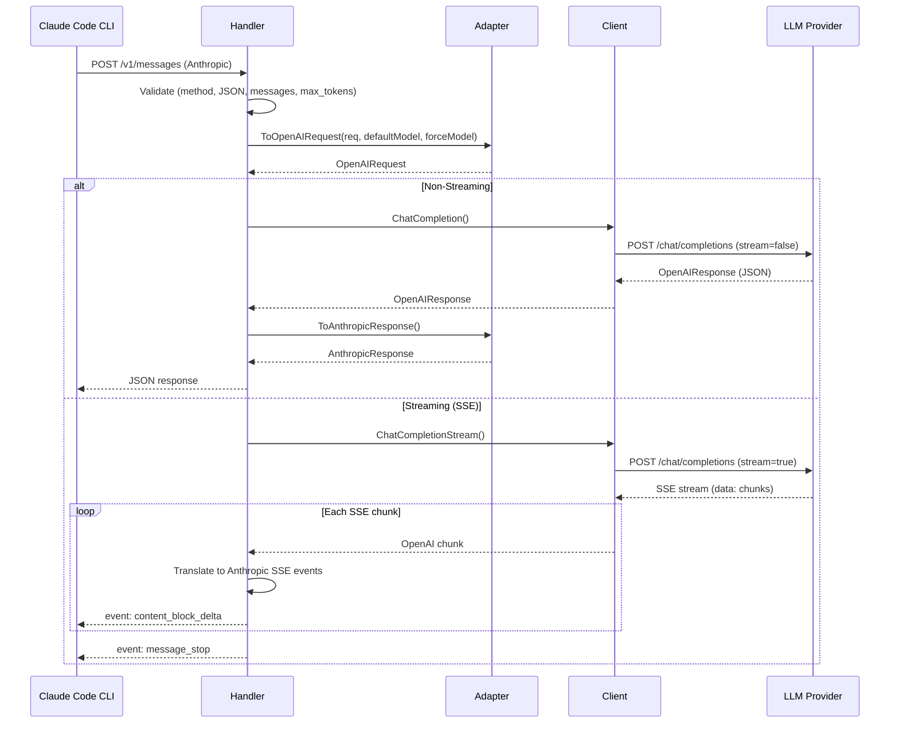
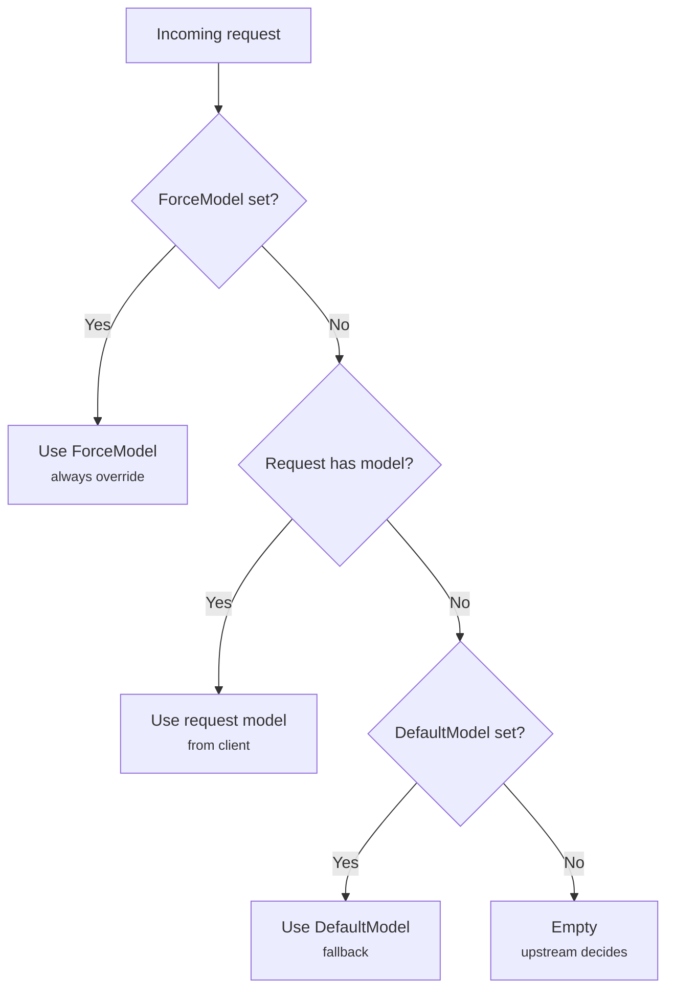

# Heimsense

<p align="center">
  <a href="https://github.com/fajarhide/heimsense/stargazers"></a>
  <a href="https://github.com/fajarhide/heimsense/releases"></a>
  <a href="./go.mod"></a>
  <a href="#supported-providers"></a>
  <a href="./Containerfile"></a>
  <a href="https://github.com/fajarhide/heimsense/actions/workflows/ci.yml"></a>
  <a href="https://github.com/fajarhide/heimsense/releases/latest"></a>
</p>

<p align="center">
  <a href="./LICENSE"></a>
  <a href="https://github.com/fajarhide/heimsense/issues"></a>
  <a href="https://github.com/fajarhide/heimsense/pulls"></a>
</p>

> *Claude Code is the supercar. Heimsense gives any LLM the keys.* 🔱

A lightweight, production-ready API adapter that gives **any LLM provider** the power of **Claude Code CLI** — by translating Anthropic's protocol to OpenAI's, and back. Zero dependencies. Single binary.

```
                          Heimsense
                       ┌─────────────┐
  Claude Code CLI ────►│  translates │────► Any LLM Provider
  (Anthropic format)   │  both ways  │      (OpenAI format)
                  ◄────│   :8080     │◄────
                       └─────────────┘
                              │
              ┌───────────────┼───────────────┐
              ▼               ▼               ▼
           OpenAI          DeepSeek         Ollama
           Groq            Mistral        LM Studio
           xAI             Together       vLLM  ...
```

---

## Why Heimsense?

### The Mythology

In Norse mythology, **Heimdall** is the guardian of Bifröst — the rainbow bridge connecting the nine realms. He possesses extraordinary senses: he can see and hear everything happening across all worlds, day and night, without sleeping. His keen perception makes him the perfect sentinel, watching over the cosmos.

### The Philosophy

**Claude Code is a supercar.** It's one of the most powerful agentic coding tools ever built — autonomous file editing, multi-step reasoning, tool orchestration, and deep codebase understanding. But out of the box, only one engine fits: Claude.

**Any LLM is a capable driver.** GPT, DeepSeek, Gemini, Llama, Qwen — they're all skilled, but they can't get behind the wheel of that supercar. The interface doesn't fit. The protocol doesn't match.

**Heimsense gives any LLM the keys.** It translates the language barrier between Anthropic's protocol and OpenAI's protocol, so any model can drive the most powerful coding CLI available — unlocking capabilities they could never access alone.

Just as Heimdall stands at the gateway of Bifröst, deciding who may cross between realms, **Heimsense** stands at the gateway between Claude Code and the vast landscape of LLM providers — letting any worthy model cross the bridge:

| Heimdall | Heimsense |
|----------|-----------|
| Guards Bifröst (the bridge) | Guards your API gateway |
| Lets worthy beings cross realms | Lets any LLM drive Claude Code |
| Sees across all nine realms | Connects to 20+ LLM providers |
| Never sleeps | Always-on, production-ready |
| Heightened senses | Intelligent request translation |
| Warns of threats | Handles errors gracefully with retries |

### The Name

**Heim** (from Heimdall) + **Sense** (perception/awareness) = **Heimsense**

The ability to sense, route, and adapt API requests across the LLM multiverse.

---

## What Problems Does It Solve?

| Problem | Solution |
|---------|----------|
| **Vendor Lock-in** | Switch providers without code changes |
| **High API Costs** | Use cheaper alternatives to Anthropic |
| **Model Limitations** | Access GPT, Gemini, DeepSeek, Llama, etc. via Claude Code |
| **API Downtime** | Automatic retry with exponential backoff |
| **Format Incompatibility** | Seamless Anthropic ↔ OpenAI translation |
| **Complex Setup** | Single binary, zero config complexity |

---

## Benefits

### Cost Savings
- Use budget-friendly providers like DeepSeek, Groq, or Together AI
- Pay fraction of Anthropic's pricing for similar capabilities

### Flexibility
- Switch between providers by changing a single environment variable
- Test and compare different models with the same interface

### Reliability
- Automatic retry on transient failures (5xx errors)
- Exponential backoff prevents overwhelming upstream
- Graceful shutdown preserves in-flight requests

### Simplicity
- Single binary deployment
- Environment-based configuration
- Works with existing Claude Code setup (one command)

### Transparency
- Structured JSON logging for observability
- Health check endpoint for monitoring
- Request/response metrics in logs

---

## How Heimsense Works

### Architecture



### Request Flow



### Model Resolution



### Steps

1. **Receive** — Claude Code sends Anthropic-format request to `/v1/messages`
2. **Validate** — Handler checks method, JSON body, required fields
3. **Transform** — Adapter converts Anthropic schema → OpenAI schema (with model resolution)
4. **Forward** — Client sends to upstream with retry logic (exponential backoff on 5xx)
5. **Adapt** — Response transformed back to Anthropic format
6. **Return** — Claude Code receives expected Anthropic response

### Translation Layer

| Anthropic | Direction | OpenAI |
|-----------|-----------|--------|
| `/v1/messages` | → | `/v1/chat/completions` |
| `content[]` array | → | `message.content` string |
| `system` field | → | `messages[0]` with role:system |
| `max_tokens` | ↔ | `max_tokens` |
| `tools` | ↔ | `tools` / `functions` |
| `input_tokens` | ← | `prompt_tokens` |
| `output_tokens` | ← | `completion_tokens` |

---

## Features

- Full `/v1/messages` → `/v1/chat/completions` translation
- Streaming (SSE) with Anthropic event protocol
- String and array content formats
- System prompt handling
- Function calling (tools) support
- Authorization header passthrough
- Retry with exponential backoff (5xx)
- Configurable timeout
- Structured JSON logging (`slog`)
- Graceful shutdown (SIGINT/SIGTERM)
- Health check endpoint (`/health`)
- Auto-setup script for Claude Code
- Container support (Podman/Docker)

---

## Requirements

- Go 1.22+ (for building from source)
- Podman or Docker (for containerized deployment)
- API key from any OpenAI-compatible provider

---

## Quick Start

### Option 1: One-Line Install (Recommended)

```bash
curl -fsSL https://raw.githubusercontent.com/fajarhide/heimsense/main/scripts/install.sh | bash
```

This will:
1. Auto-detect your OS & architecture
2. Download the latest binary from GitHub Releases
3. Install to `~/.local/bin/`
4. Configure Claude Code settings (prompts for API key)

Then start Heimsense and run Claude:

```bash
heimsense

# In another terminal:
claude
# Inside Claude → /model → select Heimsense Custom Model
```

Config is saved to `~/.heimsense/.env` — edit it anytime to change provider, key, or model.

### Option 2: Native Go

```bash
# 1. Setup environment
cp env.example .env
# Edit .env → set your ANTHROPIC_API_KEY

# 2. Start Heimsense
make run

# 3. Configure Claude Code
make setup

# 4. Run Claude Code
claude

# 5. Select Model (inside Claude)
/model
# Select your custom model (e.g., Heimsense Model)
```

### Option 2: Podman

```bash
# 1. Setup environment
cp env.example .env
# Edit .env → set your ANTHROPIC_API_KEY

# 2. Build and run
make podman-build
make podman-run

# 3. Configure Claude Code
make setup

# 4. Run Claude Code
claude

# 5. Select Model (inside Claude)
/model
# Select your custom model (e.g., Heimsense Model)
```

### Option 3: Docker

```bash
# 1. Setup environment
cp env.example .env

# 2. Build and run
make docker-build
make docker-run

# 3. Configure Claude Code
make setup

# 4. Run Claude Code
claude

# 5. Select Model (inside Claude)
/model
# Select your custom model (e.g., Heimsense Model)
```

---

## Configuration

All configuration via environment variables (or `.env` file):

| Variable | Default | Description |
|----------|---------|-------------|
| `ANTHROPIC_BASE_URL` | `https://api.openai.com/v1` | Upstream OpenAI-compatible API |
| `ANTHROPIC_API_KEY` | — | Fallback API key for upstream |
| `ANTHROPIC_CUSTOM_MODEL_OPTION` | — | Default model if request doesn't specify one |
| `ANTHROPIC_CUSTOM_MODEL_OPTION_NAME` | — | Display name in Claude Code `/model` menu |
| `ANTHROPIC_CUSTOM_MODEL_OPTION_DESCRIPTION` | — | Description shown in Claude Code `/model` menu |
| `ANTHROPIC_CUSTOM_FORCE_MODEL` | — | Force all requests to use this model (overrides client) |
| `LISTEN_ADDR` | `:8080` | Server listen address |
| `REQUEST_TIMEOUT_MS` | `120000` | Upstream timeout (ms) |
| `MAX_RETRIES` | `3` | Retry attempts on 5xx errors |

### Example `.env`

```bash
ANTHROPIC_BASE_URL=https://api.openai.com/v1
ANTHROPIC_API_KEY=sk-your-api-key-here
ANTHROPIC_CUSTOM_MODEL_OPTION=gpt-5.1
ANTHROPIC_CUSTOM_FORCE_MODEL=
LISTEN_ADDR=:8080
REQUEST_TIMEOUT_MS=120000
MAX_RETRIES=3
```

---

## Supported Providers

Heimsense works with any OpenAI-compatible API:

### General LLM Providers

| Provider | Base URL | Notes |
|----------|----------|-------|
| OpenAI | `https://api.openai.com/v1` | Official GPT models |
| [DeepSeek](https://deepseek.com) | `https://api.deepseek.com/v1` | Excellent for coding, competitive pricing |
| [GLM (Zhipu AI)](https://open.bigmodel.cn) | `https://open.bigmodel.cn/api/paas/v4` | Chinese LLM, GLM-4 series |
| [MiniMax](https://minimax.chat) | `https://api.minimax.chat/v1` | Chinese LLM provider |
| [Groq](https://groq.com) | `https://api.groq.com/openai/v1` | Ultra-fast inference (LPU) |
| [Together AI](https://together.ai) | `https://api.together.xyz/v1` | Open-source models |
| [OpenRouter](https://openrouter.ai) | `https://openrouter.ai/api/v1` | Multi-provider gateway |
| [Fireworks AI](https://fireworks.ai) | `https://api.fireworks.ai/inference/v1` | Fast serverless inference |
| [Replicate](https://replicate.com) | `https://api.replicate.com/v1` | Model hosting platform |
| [Perplexity](https://perplexity.ai) | `https://api.perplexity.ai` | Search-augmented LLM |
| [Mistral](https://mistral.ai) | `https://api.mistral.ai/v1` | European LLM provider |
| [Cohere](https://cohere.com) | `https://api.cohere.ai/v1` | Enterprise LLM |
| [xAI (Grok)](https://x.ai) | `https://api.x.ai/v1` | Elon Musk's AI company |

### Coding-Focused LLMs

| Provider | Models | Best For |
|----------|--------|----------|
| [DeepSeek](https://deepseek.com) | `deepseek-coder` | Code generation, debugging |
| [Cursor](https://cursor.sh) | Various | AI-powered IDE |
| [Codeium](https://codeium.com) | `codeium` | Free code completion |
| [Tabnine](https://tabnine.com) | Various | Enterprise code assistant |
| [Amazon CodeWhisperer](https://aws.amazon.com/codewhisperer) | Various | AWS-integrated coding |
| [Sourcegraph Cody](https://sourcegraph.com/cody) | Various | Code understanding |
| [Replit AI](https://replit.com) | Various | Browser-based coding |
| [CodeLlama](https://huggingface.co/codellama) | `codellama-*` | Meta's code model (via Ollama/Together) |
| [StarCoder](https://huggingface.co/bigcode) | `starcoder*` | BigCode's models (via Ollama/Together) |

### Local / Self-Hosted

| Provider | Base URL | Notes |
|----------|----------|-------|
| [Ollama](https://ollama.ai) | `http://localhost:11434/v1` | Run models locally |
| [LM Studio](https://lmstudio.ai) | `http://localhost:1234/v1` | GUI for local models |
| [vLLM](https://github.com/vllm-project/vllm) | `http://localhost:8000/v1` | High-performance serving |
| [LocalAI](https://localai.io) | `http://localhost:8080/v1` | Drop-in OpenAI replacement |
| [Text Generation WebUI](https://github.com/oobabooga/text-generation-webui) | Varies | Flexible local inference |

### Popular Models by Use Case

| Use Case | Recommended Models |
|----------|-------------------|
| **General Chat** | `gpt-4o`, `claude-3-opus`, `glm-4`, `deepseek-chat` |
| **Coding** | `deepseek-coder`, `gpt-4o`, `claude-3.5-sonnet`, `codellama-70b` |
| **Fast/Cheap** | `gpt-4o-mini`, `deepseek-chat`, `glm-4-flash`, `groq-llama3` |
| **Large Context** | `claude-3-opus` (200K), `glm-4` (128K), `deepseek` (64K) |
| **Local** | `llama3`, `codellama`, `mistral`, `qwen2.5-coder` |

---

## Using with Claude Code

### Auto Setup (Recommended)

```bash
make setup
```

This updates `~/.claude/settings.json`:

```diff
 {
   "env": {
-    "ANTHROPIC_BASE_URL": "https://api.anthropic.com",
+    "ANTHROPIC_BASE_URL": "http://localhost:8080",
     "ANTHROPIC_AUTH_TOKEN": "sk-xxx",
   }
 }
```

**To revert:**

```bash
make revert
```

### Manual Setup

```bash
export ANTHROPIC_BASE_URL=http://localhost:8080
export ANTHROPIC_API_KEY=your-api-key
claude
```

---

## Container Deployment

### Podman

```bash
# Build
podman build -t heimsense:latest .

# Run
podman run -d \
  --name heimsense \
  -p 8080:8080 \
  --env-file .env \
  heimsense:latest

# Or with compose
podman-compose up -d
```

### Docker

```bash
# Build
docker build -t heimsense:latest .

# Run
docker run -d \
  --name heimsense \
  -p 8080:8080 \
  --env-file .env \
  heimsense:latest

# Or with compose
docker compose up -d
```

### Container Features

- Multi-stage build (~15MB image)
- Non-root user for security
- Read-only filesystem with tmpfs
- Health check support
- Graceful shutdown

---

## Make Targets

```bash
# Development
make run        # Build + start server
make dev        # Run via `go run`
make build      # Compile to ./bin/
make test       # Run tests
make fmt        # Format code
make lint       # Run go vet
make clean      # Remove build artifacts

# Claude Code Setup
make setup      # Configure Claude Code
make revert     # Revert settings

# Docker
make docker-build   # Build image
make docker-run     # Run with compose
make docker-stop    # Stop compose
make docker-logs    # View logs

# Podman
make podman-build   # Build image
make podman-run     # Run with compose
make podman-stop    # Stop compose
make podman-logs    # View logs

# Help
make help
```

---

## API Endpoints

### `POST /v1/messages`

**Non-streaming:**

```bash
curl -X POST http://localhost:8080/v1/messages \
  -H "Content-Type: application/json" \
  -H "Authorization: Bearer your-key" \
  -d '{
    "model": "gpt-5.1",
    "max_tokens": 1024,
    "messages": [{"role": "user", "content": "Hello!"}]
  }'
```

**Streaming:**

```bash
curl -X POST http://localhost:8080/v1/messages \
  -H "Content-Type: application/json" \
  -H "Authorization: Bearer your-key" \
  -d '{
    "model": "gpt-5.1",
    "max_tokens": 1024,
    "stream": true,
    "messages": [{"role": "user", "content": "Tell me a story"}]
  }'
```

**With tools:**

```bash
curl -X POST http://localhost:8080/v1/messages \
  -H "Content-Type: application/json" \
  -H "Authorization: Bearer your-key" \
  -d '{
    "model": "gpt-5.1",
    "max_tokens": 1024,
    "tools": [{
      "name": "get_weather",
      "description": "Get weather",
      "input_schema": {
        "type": "object",
        "properties": {"location": {"type": "string"}},
        "required": ["location"]
      }
    }],
    "messages": [{"role": "user", "content": "Weather in Tokyo?"}]
  }'
```

### `GET /health`

```bash
curl http://localhost:8080/health
# → {"status":"ok"}
```

---

## API Translation Reference

### Request: Anthropic → OpenAI

| Anthropic | OpenAI | Notes |
|-----------|--------|-------|
| `model` | `model` | Pass-through with fallback |
| `messages` | `messages` | Arrays flattened |
| `system` | `messages[0]` | Prepended as system |
| `max_tokens` | `max_tokens` | Direct |
| `temperature` | `temperature` | Direct |
| `top_p` | `top_p` | Direct |
| `stream` | `stream` | Enables SSE |
| `stop_sequences` | `stop` | Direct |
| `tools` | `tools` | Function calling |

### Response: OpenAI → Anthropic

| OpenAI | Anthropic |
|--------|-----------|
| `choices[0].message.content` | `content[0].text` |
| `choices[0].message.tool_calls` | `content[].tool_use` |
| `usage.prompt_tokens` | `usage.input_tokens` |
| `usage.completion_tokens` | `usage.output_tokens` |
| `finish_reason: "stop"` | `stop_reason: "end_turn"` |
| `finish_reason: "length"` | `stop_reason: "max_tokens"` |
| `finish_reason: "tool_calls"` | `stop_reason: "tool_use"` |

### Streaming Events

```
message_start → content_block_start
  → content_block_delta (repeated)
    → content_block_stop → message_delta → message_stop
```

---

## Project Structure

```
heimsense/
├── .github/workflows/              # CI, Release, Docker
├── cmd/server/main.go              # Entry point + logging middleware
├── internal/
│   ├── adapter/
│   │   ├── transform.go            # Anthropic ↔ OpenAI transformation
│   │   └── transform_test.go       # Adapter tests
│   ├── client/
│   │   ├── openai.go               # HTTP client + retry
│   │   └── openai_test.go          # Client tests
│   ├── config/
│   │   ├── config.go               # Config loader
│   │   ├── config_test.go          # Config tests
│   │   └── dotenv.go               # .env file parser
│   └── handler/
│       ├── messages.go             # Request handler + SSE streaming
│       └── messages_test.go        # Handler tests
├── scripts/
│   ├── install.sh                  # One-line installer
│   └── setup-claude.sh             # Claude Code setup
├── Containerfile                   # Container build
├── docker-compose.yaml             # Compose config
├── Makefile                        # Build targets
├── env.example                     # Config template
├── LICENSE                         # MIT License
└── go.mod                          # Module definition
```

---

## Development

### Run Tests

```bash
make test
```

### Build

```bash
make build  # ./bin/heimsense
```

### Code Quality

```bash
make fmt
make lint
```

---

## Troubleshooting

### Port in use

```bash
lsof -i :8080
LISTEN_ADDR=:8081 make run
```

### View logs

```bash
make podman-logs
# or
make docker-logs
```

### Auth errors

- Check `ANTHROPIC_API_KEY` in `.env`
- Verify `ANTHROPIC_BASE_URL` is correct
- Ensure key format matches provider requirements

---

## Comparison with Alternatives

Several open-source projects solve the same problem — bridging Claude Code CLI to non-Anthropic providers. Here's how Heimsense compares:

### Similar Projects

| Project | Language | Approach | Dependencies |
|---------|----------|----------|-------------|
| [claude-code-proxy](https://github.com/fuergaosi233/claude-code-proxy) (fuergaosi233) | Python | Full-featured proxy with model mapping | Python runtime, pip packages |
| [claude-code-proxy](https://github.com/1rgs/claude-code-proxy) (1rgs) | Python | LiteLLM-powered, supports 100+ providers | Python, LiteLLM, many transitive deps |
| [anthropic-proxy-rs](https://github.com/m0n0x41d/anthropic-proxy-rs) | Rust | High-performance binary | Rust toolchain to build |
| [claude-adapter](https://github.com/shantoislamdev/claude-adapter) | Node.js | Interactive CLI wizard for setup | Node.js runtime, npm packages |
| **Heimsense** | **Go** | **Single binary, zero runtime dependencies** | **None (pure Go stdlib)** |

### Feature Comparison

| Feature | Heimsense | Python proxies | Rust proxy | Node.js adapter |
|---------|-----------|---------------|------------|-----------------|
| Single binary deployment | ✅ | ❌ (needs runtime) | ✅ | ❌ (needs runtime) |
| Zero dependencies | ✅ | ❌ | ✅ | ❌ |
| Streaming (SSE) | ✅ | ✅ | ✅ | ✅ |
| Tool calling / function calling | ✅ | ✅ | ✅ | ✅ |
| Retry with backoff | ✅ | Varies | ❌ | ❌ |
| Container image size | ~15 MB | 100+ MB | ~10 MB | 150+ MB |
| One-line install script | ✅ | ❌ | ❌ | ❌ |
| Auto Claude Code setup | ✅ | Varies | ❌ | ✅ |
| Structured JSON logging | ✅ | Varies | ✅ | ❌ |
| Health check endpoint | ✅ | ❌ | ❌ | ❌ |
| Model force override | ✅ | ❌ | ❌ | ❌ |
| Auth header passthrough | ✅ | ✅ | ✅ | ✅ |
| Codebase size | ~700 lines | 1000+ lines | 500+ lines | 800+ lines |
| Easy to read & contribute | ✅ (Go) | ✅ (Python) | ⚠️ (Rust) | ✅ (JS) |

### When to Use Heimsense

Heimsense is the best choice when you want:

- **Minimal footprint** — A single binary with no runtime dependencies (no Python, Node, or Rust toolchain needed)
- **Fast deployment** — Download, configure, run. One-line install or copy the binary
- **Tiny containers** — ~15 MB container image, ideal for resource-constrained environments
- **Readable codebase** — ~700 lines of straightforward Go, easy to audit, fork, and extend
- **Production-ready defaults** — Built-in retry, graceful shutdown, structured logging, and health checks out of the box

### When to Use Alternatives

- **100+ provider support** — If you need routing to obscure providers, LiteLLM-based proxies have wider coverage
- **Python ecosystem** — If your team is Python-first and prefers `pip install` workflows
- **Maximum performance** — The Rust proxy (`anthropic-proxy-rs`) may have slightly lower latency for extremely high-throughput use cases
- **Interactive setup wizard** — `claude-adapter` provides a guided CLI experience for first-time configuration

### Design Philosophy

Heimsense follows the Unix philosophy: **do one thing well**.

```
┌──────────────────────────────────────────────────────────┐
│                    Design Principles                     │
├──────────────────────────────────────────────────────────┤
│  • Zero external dependencies (pure Go standard library) │
│  • Single responsibility (Anthropic ↔ OpenAI, nothing   │
│    else)                                                 │
│  • Convention over configuration (sensible defaults)     │
│  • Transparency (structured logs for every request)      │
│  • Resilience (retry, backoff, graceful shutdown)        │
└──────────────────────────────────────────────────────────┘
```

The entire adapter is ~700 lines of Go. There is no framework, no ORM, no dependency injection, no magic. Every line serves the core mission: **translate Anthropic requests to OpenAI format and back, reliably.**

---

## License

MIT

---

> *"Heimdall guards the Bifröst, so that any worthy being may cross between realms."* — Heimsense guards your API, so that any LLM may drive Claude Code. 🔱
